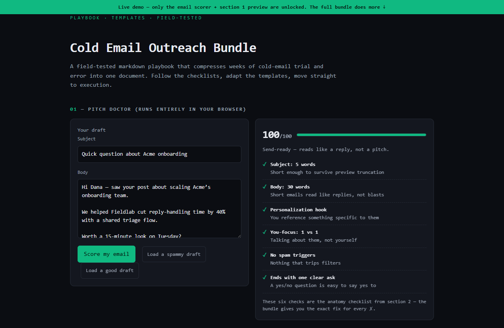

# Cold Email Outreach Bundle — live demo

  

  <a href="https://amos-mig.github.io/cold-email-outreach-bundle-demo/"><strong>▶ Open the live demo</strong></a> ·
  <a href="https://amosmign.gumroad.com/l/cold-email-outreach-bundle"><strong>Get the full product · €7</strong></a>

## What this is

A live teaser for the Cold Email Outreach Bundle playbook: a working client-side 'pitch doctor' that scores the visitor's cold email draft against six real checklist rules, plus an expandable document preview where section 1 is readable and the rest are locked. Feature cards, a partial markdown excerpt, and the buy CTA prove the value while the full templates, cadences and scripts stay behind the paywall.

**Try it:** Click 'Load a spammy draft' then 'Load a good draft' to watch the score jump, or paste your own cold email and hit 'Score my email'.

## What you get in the full product

- Step-by-step structure — know exactly what to do next
- Checklists and tables you can fill in and reuse
- Written from real-world practice, not theory
- Instant digital download — read it in any markdown viewer or Notion

## About

- **Storefront:** [kits.amosmignery.dev](https://kits.amosmignery.dev) — single-file products, instant download, commercial license
- **Checkout:** [Gumroad](https://amosmign.gumroad.com/l/cold-email-outreach-bundle) (Merchant of Record, VAT handled)
- **Full product:** [Cold Email Outreach Bundle](https://amosmign.gumroad.com/l/cold-email-outreach-bundle) · €7

## License

The demo page in this repo is MIT-licensed — reuse the technique, not the product.
The **Cold Email Outreach Bundle** itself is not included here and is not free software.
